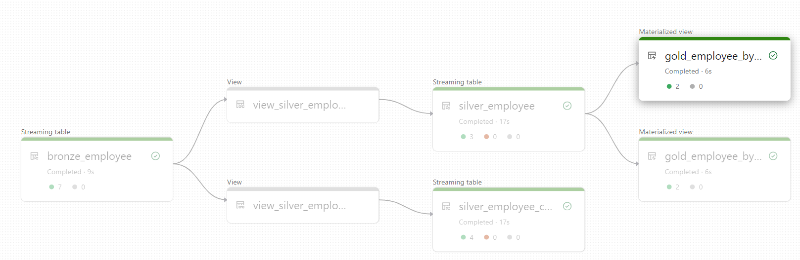
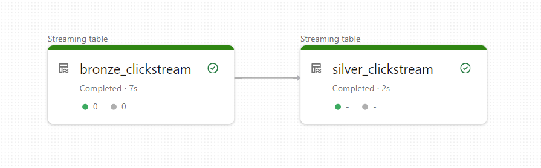

xdbutils - Extended dbutils (Databricks utilities).

This package provides a simple framework for setting up data pipelines following the [Databricks Medallion Architecture](https://www.databricks.com/glossary/medallion-architecture). 

You can choose to use the [Delta Live Tables framework](#using-the-delta-live-tables-dlt-framework) or [straight up python DataLakeHouse framework](#using-the-data-lakehouse-framework).

The package is built for Databricks runtime 13.0 or higher.

Table of contents:
- [Installing the library in a Databricks notebook](#installing-the-library-in-a-databricks-notebook)
- [Using the Delta Live Tables (DLT) Framework](#using-the-delta-live-tables-dlt-framework)
  * [File-based batch ingestion](#file-based-batch-ingestion)
    + [Create Test Data](#create-test-data)
    + [Create a DLT Pipeline Object](#create-a-dlt-pipeline-object)
    + [Raw to Bronze](#raw-to-bronze)
    + [Bronze to Silver with Upsert](#bronze-to-silver-with-upsert)
    + [Bronze to Silver with Change Tracking](#bronze-to-silver-with-change-tracking)
    + [Silver to Gold](#silver-to-gold)
  * [Event-Based Ingestion](#event-based-ingestion)
    + [Event to Bronze](#event-to-bronze)
    + [Bronze to Silver with Append Only](#bronze-to-silver-with-append-only)
- [Using the Data Lakehouse Framework (straight up python)](#using-the-data-lakehouse-framework)
    + [Create Test Data](#create-test-data-1)
    + [Raw to Bronze](#raw-to-bronze-1)
    + [Bronze to Silver](#bronze-to-silver-2)
- [Using Databricks Connect](#using-databricks-connect)

# Installing the library in a Databricks notebook
Just pip install directly from the repo:

```
%pip install install git+https://github.com/henrikbulldog/xdputils.git
```

# Using the Delta Live Tables (DLT) Framework
In order to set up a Delta Live Tables pipeline, simply create a python notebook in Databricks and the method XDBUtils.create_dlt_pipeline().

## File-based batch ingestion
This section shows how to set up a pipeline for ingesting files that is scheduled to run at intervals. Only newly arrived files are processed (DLT uses AutoLoader to kep track of new files).

See also example notebook: [dlt_demo_employee.ipynb](https://github.com/henrikbulldog/xdbutils/blob/main/dlt_demo_employee.ipynb).

The resulting workflow wil look like this:



### Create Test data
Let's create some test data:

```python
import json

# Delete any existing files
dbutils.fs.rm("FileStore/datalakehouse/raw/demo/employee/", True)

# Delete AutoLoader checkpoints
dbutils.fs.rm("FileStore/datalakehouse/raw/checkpoints/demo/employee/", True)

employees1 = [
  {
    "EmpID": 1234,
    "Name": "John Doe",
    "Function": "ADM",
    "Role": "Finance",
    "Updated": "2023-01-01T11:51:11.992334"
  },
  {
    "EmpID": 1345,
    "Name": "Jane Hansen",
    "Function": "ADM",
    "Role": "Finance",
    "Updated": "2023-01-01T11:51:11.992334"
  },
  {
    "EmpID": None,
    "Name": "Invalid Row",
    "Function": "ENG",
    "Role": "Engineer",
    "Updated": "2023-01-01T11:51:11.992334"
  },
]

dbutils.fs.put(
  "FileStore/datalakehouse/raw/demo/employee/employee-20230101-115111.json",
  contents=json.dumps(employees1)
  )

employees2 = [
  {
    "EmpID": 1234,
    "Name": "John Doe",
    "Function": "ADM",
    "Role": "Finance",
    "Updated": "2023-01-02T12:52:12.992334"
  },
  {
    "EmpID": 1345,
    "Name": "Jane Doe",
    "Function": "ADM",
    "Role": "Finance",
    "Updated": "2023-01-02T12:52:12.992334"
  },
  {
    "EmpID": None,
    "Name": "Invalid Row",
    "Function": "ENG",
    "Role": "Engineer",
    "Updated": "2023-01-02T12:52:12.992334"
  },
  {
    "EmpID": 9999,
    "Name": "New Guy",
    "Function": "ENG",
    "Role": "Marketing",
    "Updated": "2023-01-02T12:52:12.992334"
  }, 
]

dbutils.fs.put(
  "FileStore/datalakehouse/raw/demo/employee/employee-20230102-125212.json",
  contents=json.dumps(employees2)
  )  
```
Test data:
```
+-----+--------+-----------+---------+--------------------------+
|EmpID|Function|Name       |Role     |Updated                   |
+-----+--------+-----------+---------+--------------------------+
|1234 |ADM     |John Doe   |Finance  |2023-01-02T12:52:12.992334|
|1345 |ADM     |Jane Doe   |Finance  |2023-01-02T12:52:12.992334|
|null |ENG     |Invalid Row|Engineer |2023-01-02T12:52:12.992334|
|9999 |ENG     |New Guy    |Marketing|2023-01-02T12:52:12.992334|
|1234 |ADM     |John Doe   |Finance  |2023-01-01T11:51:11.992334|
|1345 |ADM     |Jane Hansen|Finance  |2023-01-01T11:51:11.992334|
|null |ENG     |Invalid Row|Engineer |2023-01-01T11:51:11.992334|
+-----+--------+-----------+---------+--------------------------+
```

### Create a DLT Pipeline Object
Call XDBUtil.create_dlt_pipeline() to get a class with DLT source functions. Parameters:

|Parameter|Description|
|---------|-----------|
|**source_system**|Source system, this name will be used to create a schema in Unity Catalog|
|**source_class**|Source class or entity name, this name will be used to create tabnles and views in Unity Catalog|
|**raw_base_path**|Path to raw storage. Data will be organised as `raw_base_path/<source_system>/<source_class>`|
|tags|Tags will be added to the DTL workflow configuration and to Delta table description in Data Explorer|

```python
from xdbutils import XDBUtils

xdbutils = XDBUtils(spark, dbutils)

pipeline = xdbutils.create_dlt_pipeline_source(
  source_system = "demo",
  source_class = "employee",
  raw_base_path = "...",
  tags = {
    "data_owner": "Henrik Thomsen",
    "cost_center": "123456",
    "documentation": "https://github.com/henrikbulldog/xdbutils"
  }
)

```

### Raw to Bronze
In order to ingest data from raw to bronze, call raw_to_bronze() with parameters:

|Parameter|Description|
|---------|-----------|
|**raw_format**|Raw data format; json, csv, parquet|
|source_system|Source system, this name will be used to create a schema in Unity Catalog, default: as specified in create_dlt_pipeline()|
|source_class|Source class or entity name, this name will be used to create tabnles and views in Unity Catalog, default: as specified in create_dlt_pipeline()|
|target_class|Name of the target streaming table: bronze_<target_class>, default = source_class|
|options|Read options, i.e. {"header": True}|
|schema|Schema to be used for reading|
|parse|Transformation function|
|partitions_cols|Columns to be used for partitioning|
|expectations|[DLT expectations](https://docs.databricks.com/en/delta-live-tables/expectations.html), rows that do not meet expectations will be marked as quarantined|

Databricks Autoloader system will maintain checkpoints in `<raw_base_path>/checkpoints` so that only new data is ingested.

```python
pipeline.raw_to_bronze(
  raw_format="json",
  expectations={
    "Valid EmpID": "EmpID IS NOT NULL",
    }
)
```

This will create the table <catalog>.<source system>.bronze_<source class>, for example testing_dlt.demo.bronze_employee.

```
+-----+--------+-----------+---------+--------------------------+-------------+-----------------------+------------+
|EmpID|Function|Name       |Role     |Updated                   |_rescued_data|_ingest_time           |_quarantined|
+-----+--------+-----------+---------+--------------------------+-------------+-----------------------+------------+
|1234 |ADM     |John Doe   |Finance  |2023-01-01T11:51:11.992334|null         |2023-08-09 12:21:56.759|false       |
|1345 |ADM     |Jane Hansen|Finance  |2023-01-01T11:51:11.992334|null         |2023-08-09 12:21:56.759|false       |
|null |ENG     |Invalid Row|Engineer |2023-01-01T11:51:11.992334|null         |2023-08-09 12:21:56.759|true        |
|1234 |ADM     |John Doe   |Finance  |2023-01-02T12:52:12.992334|null         |2023-08-09 12:21:56.759|false       |
|1345 |ADM     |Jane Doe   |Finance  |2023-01-02T12:52:12.992334|null         |2023-08-09 12:21:56.759|false       |
|null |ENG     |Invalid Row|Engineer |2023-01-02T12:52:12.992334|null         |2023-08-09 12:21:56.759|true        |
|9999 |ENG     |New Guy    |Marketing|2023-01-02T12:52:12.992334|null         |2023-08-09 12:21:56.759|false       |
+-----+--------+-----------+---------+--------------------------+-------------+-----------------------+------------+
```

Bronze metadata columns:

|Column|Description|
|------|-----------|
|_rescued_data|DLT adds this column when inferring schema from json and csv. The column contains information about failed schema ingestion attempts|
|_ingest_time|Time of ingestion|
|_quarantined|False if expectations are met, True if not|

### Bronze to Silver with Upsert
[Create a DLT Pipeline Object](#create-a-dlt-pipeline-object). Call bronze_to_silver_upsert() with parameters (see also [DLT docs](https://docs.databricks.com/en/delta-live-tables/python-ref.html#change-data-capture-with-python-in-delta-live-tables)):

|Parameter|Description|
|---------|-----------|
|keys|If parameter keys is omitted, data wil be appended, otherwise data is upserted. The column or combination of columns that uniquely identify a row in the source data. This is used to identify which CDC events apply to specific records in the target table. |
|sequence_by|sequence_by must be specified if keys is specified. sequence_by if the column name specifying the logical order of CDC events in the source data. Delta Live Tables uses this sequencing to handle change events that arrive out of order.|
|ignore_null_updates|Allow ingesting updates containing a subset of the target columns. When a CDC event matches an existing row and ignore_null_updates is True, columns with a null will retain their existing values in the target. This also applies to nested columns with a value of null. When ignore_null_updates is False, existing values will be overwritten with null values|
|apply_as_deletes|Specifies when a CDC event should be treated as a DELETE rather than an upsert. To handle out-of-order data, the deleted row is temporarily retained as a tombstone in the underlying Delta table, and a view is created in the metastore that filters out these tombstones. The retention interval can be configured with the pipelines.cdc.tombstoneGCThresholdInSeconds table property|
|apply_as_truncates|Specifies when a CDC event should be treated as a full table TRUNCATE. Because this clause triggers a full truncate of the target table, it should be used only for specific use cases requiring this functionality|
|column_list|A subset of columns to include in the target table. Use column_list to specify the complete list of columns to include|
|except_column_list|Use except_column_list to specify the columns to exclude|
|parse|A function that transforms imput data. It takes a DataFrame as input and returns a DataFrame|
|expectations|[DLT expectations](https://docs.databricks.com/en/delta-live-tables/expectations.html)|

```python
pipeline.bronze_to_silver_upsert(
  keys=["emp_id"],
  sequence_by="updated",
  parse=lambda df: df.select(
    col("EmpID").alias("emp_id"),
    col("Function").alias("function"),
    col("Name").alias("name"),
    col("Role").alias("role"),
    col("Updated").alias("updated"),
    )
  )
```

This will create the table `<catalog>.<source system>.silver_<source class>`, for example `testing_dlt.demo.silver_employee`.

```
+------+--------+--------+---------+--------------------------+
|emp_id|function|name    |role     |updated                   |
+------+--------+--------+---------+--------------------------+
|1234  |ADM     |John Doe|Finance  |2023-01-02T12:52:12.992334|
|1345  |ADM     |Jane Doe|Finance  |2023-01-02T12:52:12.992334|
|9999  |ENG     |New Guy |Marketing|2023-01-02T12:52:12.992334|
+------+--------+--------+---------+--------------------------+
```

### Bronze to Silver with Change Tracking
[Create a DLT Pipeline Object](#create-a-dlt-pipeline-object). If you want to track changes to a slow changing dimension, call bronze_to_silver_track_changes() with parameters (see also [DLT docs](https://docs.databricks.com/en/delta-live-tables/python-ref.html#change-data-capture-with-python-in-delta-live-tables)):

|Parameter|Description|
|---------|-----------|
|**keys**|The column or combination of columns that uniquely identify a row in the source data. This is used to identify which CDC events apply to specific records in the target table|
|**sequence_by**|The column name specifying the logical order of CDC events in the source data. Delta Live Tables uses this sequencing to handle change events that arrive out of order|
|stored_as_scd_type|Whether to store records as SCD type 1 or SCD type 2.Set to 1 for SCD type 1 or 2 for SCD type 2. Default is set to 2|
|ignore_null_updates|Allow ingesting updates containing a subset of the target columns. When a CDC event matches an existing row and ignore_null_updates is True, columns with a null will retain their existing values in the target. This also applies to nested columns with a value of null. When ignore_null_updates is False, existing values will be overwritten with null values|
|apply_as_deletes|Specifies when a CDC event should be treated as a DELETE rather than an upsert. To handle out-of-order data, the deleted row is temporarily retained as a tombstone in the underlying Delta table, and a view is created in the metastore that filters out these tombstones. The retention interval can be configured with the pipelines.cdc.tombstoneGCThresholdInSeconds table property|
|apply_as_truncates|Specifies when a CDC event should be treated as a full table TRUNCATE. Because this clause triggers a full truncate of the target table, it should be used only for specific use cases requiring this functionality|
|column_list|A subset of columns to include in the target table. Use column_list to specify the complete list of columns to include|
|except_column_list|Use except_column_list to specify the columns to exclude|
|parse|A function that transforms imput data. It takes a DataFrame as input and returns a DataFrame|
|expectations|[DLT expectations](https://docs.databricks.com/en/delta-live-tables/expectations.html)|

```python
from pyspark.sql.functions import *

pipeline.bronze_to_silver_track_changes(
  keys=["emp_id"],
  sequence_by="updated",
  parse=lambda df: df.select(
    col("EmpID").alias("emp_id"),
    col("Function").alias("function"),
    col("Name").alias("name"),
    col("Role").alias("role"),
    col("Updated").alias("updated"),
    )
  )
  ```

This will create the table `<catalog>.<source system>.silver_<source class>_changes`, for example `testing_dlt.demo.silver_employee_changes`. In this example changes are tracked using SCD type 2, meaning the columns __START_AT and __END_AT specifies the time period for the row.

```
+------+--------+-----------+---------+--------------------------+--------------------------+--------------------------+
|emp_id|function|name       |role     |updated                   |__START_AT                |__END_AT                  |
+------+--------+-----------+---------+--------------------------+--------------------------+--------------------------+
|1234  |ADM     |John Doe   |Finance  |2023-01-02T12:52:12.992334|2023-01-01T11:51:11.992334|null                      |
|1345  |ADM     |Jane Hansen|Finance  |2023-01-01T11:51:11.992334|2023-01-01T11:51:11.992334|2023-01-02T12:52:12.992334|
|1345  |ADM     |Jane Doe   |Finance  |2023-01-02T12:52:12.992334|2023-01-02T12:52:12.992334|null                      |
|9999  |ENG     |New Guy    |Marketing|2023-01-02T12:52:12.992334|2023-01-02T12:52:12.992334|null                      |
+------+--------+-----------+---------+--------------------------+--------------------------+--------------------------+
```

### Silver to Gold
[Create a DLT Pipeline Object](#create-a-dlt-pipeline-object). Call silver_to_gold() with silver to gold transformation method, with parameters:

|Parameter|Description|
|---------|-----------|
|**name**|Gold table name prefix as in `gold_<source class>_<name>`, i.e. gold_co2emis_top_10|
|parse|A function that transforms imput data. It takes a DataFrame as input and returns a DataFrame|
|expectations|[DLT expectations](https://docs.databricks.com/en/delta-live-tables/expectations.html)|

```python
pipeline.silver_to_gold(
  name="by_function",
  parse=lambda df: df.groupBy("function").agg(count("*").alias("total")),
  )

pipeline.silver_to_gold(
  name="by_role",
  parse=lambda df: df.groupBy("role").agg(count("*").alias("total")),
  )  
```

This will create the tables `<catalog>.<source system>.gold_<source class>_<name>`, for example `testing_dlt.textcdc.gold_employee_by_function` and `testing_dlt.textcdc.gold_employee_by_role`.

```
+--------+-----+
|function|total|
+--------+-----+
|ADM     |2    |
|ENG     |1    |
+--------+-----+

+---------+-----+
|role     |total|
+---------+-----+
|Finance  |2    |
|Marketing|1    |
+---------+-----+
```

## Event-Based ingestion
This section shows how to set up a pipeline the ingests data from an event hub.

See also example notebook: [dlt_demo_clickstream.ipynb](https://github.com/henrikbulldog/xdbutils/blob/main/dlt_demo_clickstream.ipynb).

The resulting DLT workflow will look like this:



### Event to Bronze
[Create a DLT Pipeline Object](#create-a-dlt-pipeline-object). In order to ingest data from an event hub to bronze, call event_to_bronze() with parameters:

|Parameter|Description|
|---------|-----------|
|**eventhub_namespace**|Event hub namespace|
|**eventhub_name**|Event hub name|
|**eventhub_group_id**|Event hub group id|
|client_id|Client ID for Entra ID authentication to the Event Hub|
|client_secret|Client secret for Entra ID authentication to the Event Hub|
|azure_tenant_id|Azure tenant ID for Entra ID authentication to the Event Hub|
|eventhub_connection_string|Event hub connection string, Entra ID authentication is encouraged|
|max_offsets_per_trigger|Rate limit on maximum number of offsets processed per trigger interval. The specified total number of offsets will be proportionally split across topicPartitions of different volume|
|starting_offsets|The start point when a query is started, either "earliest" which is from the earliest offsets, "latest" which is just from the latest offsets, or a json string specifying a starting offset for each TopicPartition. In the json, -2 as an offset can be used to refer to earliest, -1 to latest. Note: This only applies when a new Streaming query is started, and that resuming will always pick up from where the query left off. Newly discovered partitions during a query will start at earliest|
|target_class|Name of the target streaming table: bronze_<target_class>, default = source_class|
|parse|A function that transforms imput data. It takes a DataFrame as input and returns a DataFrame|
|partition_cols|An optional collection, for example, a list, of one or more columns to use for partitioning the table|
|expectations|[DLT expectations](https://docs.databricks.com/en/delta-live-tables/expectations.html), rows that do not meet expectations will be marked as quarantined|


```python
pipeline.event_to_bronze(
  eventhub_namespace="<event hub namespace>",
  eventhub_name="<event hub name>",
  eventhub_group_id="<event hub group id>",
  eventhub_connection_string=dbutils.secrets().get(scope="<scope>", key="<secret>")
)
```

This will create the table <catalog>.<source system>.bronze_<source class>, for example testing_dlt.demo.clickstream.

```
+----+-----+----------+---------+------+----------------------+-------------+-----------------------+------------+
|key |value|topic     |partition|offset|timestamp             |timestampType|_ingest_time           |_quarantined|
+----+-----+----------+---------+------+----------------------+-------------+-----------------------+------------+
|null|...  |testihubi2|0        |364   |2023-08-11 11:43:14.07|0            |2023-08-11 11:43:16.087|false       |
|null|...  |testihubi2|0        |365   |2023-08-11 11:43:14.07|0            |2023-08-11 11:43:16.087|false       |
|null|...  |testihubi2|0        |366   |2023-08-11 11:43:14.07|0            |2023-08-11 11:43:16.087|false       |
|null|...  |testihubi2|0        |367   |2023-08-11 11:43:14.07|0            |2023-08-11 11:43:16.087|false       |
|null|...  |testihubi2|0        |368   |2023-08-11 11:43:14.07|0            |2023-08-11 11:43:16.087|false       |
|null|...  |testihubi2|0        |369   |2023-08-11 11:43:14.07|0            |2023-08-11 11:43:16.087|false       |
|null|...  |testihubi2|0        |370   |2023-08-11 11:43:14.07|0            |2023-08-11 11:43:16.087|false       |
+----+-----+----------+---------+------+----------------------+-------------+-----------------------+------------+
```

Bronze metadata columns:

|Column|Description|
|------|-----------|
|_ingest_time|Time of ingestion|
|_quarantined|False if expectations are met, True if not|

### Bronze to Silver with Append Only
[Create a DLT Pipeline Object](#create-a-dlt-pipeline-object). Call bronze_to_silver_append() with parameters:

|Parameter|Description|
|---------|-----------|
|parse|A function that transforms imput data. It takes a DataFrame as input and returns a DataFrame|
|expectations|[DLT expectations](https://docs.databricks.com/en/delta-live-tables/expectations.html)|

```python
from pyspark.sql.types import StructType, StructField, StringType, IntegerType, BooleanType
from pyspark.sql.functions import col, from_json

json_schema = StructType([  
    StructField("timeStamp", StringType()),
    StructField("ipAddress", StringType()),
    StructField("userId", StringType()),
    StructField("sessionId", StringType()),
    StructField("path", StringType()),
    StructField("queryParameters", StringType()),
    StructField("referrerUrl", StringType()),
    StructField("os", StringType()),
    StructField("browser", StringType()),
    StructField("timeToCompletePage", IntegerType()),
    StructField("eventFirstTimestamp", IntegerType()),
    StructField("eventDuration", IntegerType()),
    StructField("eventScore", IntegerType()),
    StructField("deviceType", StringType()),
    StructField("isLead", BooleanType()),
    StructField("diagnostics", StringType()),
    ])

pipeline.bronze_to_silver_append(
  parse=lambda df: (
    df
    .select(from_json(col("value").cast(StringType()), json_schema).alias("payload"))
    .select("payload.*")
    .where(col("timestamp").isNotNull())
  )
)
```

This will create the table `<catalog>.<source system>.silver_<source class>`, for example `testing_dlt.demo.silver_clickstream`.

```
+-------------------+------------+------------------------------------+------------------------------------+----------------------------------+-------------------+--------------------------------+-------+-------+------------------+-------------------+-------------+----------+----------+------+-----------+
|timeStamp          |ipAddress   |userId                              |sessionId                           |path                              |queryParameters    |referrerUrl                     |os     |browser|timeToCompletePage|eventFirstTimestamp|eventDuration|eventScore|deviceType|isLead|diagnostics|
+-------------------+------------+------------------------------------+------------------------------------+----------------------------------+-------------------+--------------------------------+-------+-------+------------------+-------------------+-------------+----------+----------+------+-----------+
|2020-12-29 9:30:20 |123.45.60.45|469b775c-6ab0-48ce-b321-08dc26c3b6cf|a7f4b4bb-1107-4a35-b1dd-fb666de8edc7|/.netlify/functions/registration  |?token=12345-ABCD  |http://example.com/about.html   |Windows|Chrome |2100              |365476             |1000         |95        |phone     |true  |           |
|2020-12-25 10:12:23|192.45.30.90|178f1cf3-effb-4d07-8c2f-3a5909724164|858560da-bb43-4f37-8c30-8e71d7ef71bb|/.netlify/functions/productListing|?category=furniture|http://example.com/product.html |iOS    |Safari |1800              |236620             |1400         |80        |laptop    |false |Debug Info |
|2020-11-29 11:45:11|87.20.10.12 |be845ccb-adf1-4ef7-b194-b620f2e309c9|824394ec-bfb4-4f4c-8e3a-c55ccd9fa7c0|/.netlify/functions/contact       |?from=homePage     |http://example.com/index.html   |Android|firefox|2400              |389177             |800          |45        |tablet    |false |null       |
|2020-10-22 8:18:16 |45.30.12.90 |8476054a-f9ca-4882-9e10-355ae7c0054b|171599e6-ec9d-4ac6-8f6c-2cefbfccad00|/.netlify/functions/registration  |?token=54321-DCBA  |http://example.com/register.html|Windows|Chrome |2000              |632736             |1500         |70        |phone     |false |null       |
|2020-09-11 12:30:51|192.19.80.30|3a3b6649-9741-4750-8829-6db0b1f65c9a|996a7dde-90fe-48d2-8cb8-1c73837b9c44|/.netlify/functions/missingPage   |?from=randomLink   |http://example.com/articles.html|iOS    |Safari |2800              |436273             |600          |60        |laptop    |true  |null       |
|2020-08-31 7:45:45 |5.60.20.67  |3da8f619-8468-486c-bffd-abfaffe6f99e|ac6ac571-6f35-4bd1-a980-706dc00f7ece|/.netlify/functions/productListing|?category=toys     |http://example.com/category.html|Android|firefox|2700              |749377             |200          |20        |tablet    |false |Debug Info |
|2020-07-25 9:15:25 |90.12.45.67 |31ceebd2-0273-4841-9bf9-316e7bed8845|531d32f2-502e-41f9-9451-3fcdac6ac1ba|/.netlify/functions/contact       |?from=socialMedia  |http://example.com/contact.html |Windows|Chrome |3700              |426368             |1900         |50        |phone     |false |null       |
+-------------------+------------+------------------------------------+------------------------------------+----------------------------------+-------------------+--------------------------------+-------+-------+------------------+-------------------+-------------+----------+----------+------+-----------+
```

# Using the Data Lakehouse Framework
If you prefer to set up data pipelines with straight up pythoin rather than Delta Live Tables, you can use the method XDButils.create_datalakehouse().

## Declare a DataLakeHouse
Call XDButils.create_datalakehouse() with parameters:

|Parameter|Description|
|-|-|
|raw_path|Base path to raw files|
|bronze_path|Base path to bronze data|
|silver_path|Base path to silver data|
|gold_path|Base path to gold data|


```python
from xdbutils import XDBUtils

xdbutils = XDBUtils(spark, dbutils)

datalakehouse = xdbutils.create_datalakehouse(
  raw_path="dbfs:/Datalakehouse/raw",
  bronze_path="dbfs:/Datalakehouse/bronze",
  silver_path="dbfs:/Datalakehouse/silver",
  gold_path="dbfs:/Datalakehouse/gold"
)
```

## Create Test Data

```python
testdata = {
    "total": 2,
    "dataset": "CO2Emis",
    "records": [
        {
            "Minutes5UTC": "2022-01-01T22:50:00",
            "CO2Emission": 70.000000
        },
        {
            "Minutes5UTC": "2022-01-01T22:55:00",
            "CO2Emission": 65.000000
        }
    ]
}

dbutils.fs.put("dbfs:/Datalakehouse/raw/eds/co2emis/testdata.json", json.dumps(testdata), True)
```

## Raw to Bronze
Read from json, explode nested json to tabular and append data to bronze delta table:

```python
from pyspark.sql.functions import explode

raw2bronze_job = (
    datalakehouse
    .raw2bronze_job(source_system="eds", source_class="co2emis")
    .read_from_json(options={"multiline": True})
    .transform(lambda df: (
        df.withColumn("record", explode("records"))
        .select(
            "record.*",
            )
        )
    )
    .write_append(table=source_entity, catalog="dev_helen_bronze")
)

raw2bronze_job.run()
```

## Bronze to Silver
Read from bronze delta table, harmonize column names and append data to silver delta table:

```python
from pyspark.sql.functions import col

bronze2silver_job = (
  datalakehouse
  .bronze2silver_job(source_system="eds", source_entity="co2emis")
  .transform(lambda df: (
    df
    .select(
      col("CO2Emission").alias("value"),
      col("Minutes5UTC").cast("timestamp").alias("timestamp"),
      col("PriceArea").alias("price_area"),
      )
    )
  )
  .write_append(table=source_entity, catalog="my_catalog")

bronze2silver_job.run()    
)
```

## Delete GDPR Personal Identifiable Information
You may have to delete Personal Identifiable Information in order to comply with GDPR Right to be Forgotten.
Be very careful when setting arguments - data cannot be recovered !!!

The XDBUtils DLT Framework supports Solution 3 (a) as described in https://www.databricks.com/blog/handling-right-be-forgotten-gdpr-and-ccpa-using-delta-live-tables-dlt.

Wait patiently when running the notebok:
- Data is deleted from bronze tables
- The DLT pipeline is started with selected full refresh for silver and gold tables and this notebook waits for it to complete
- Tables are checked to see if data has been removed

Call XDButils.delete_persons() with parameters:

|Parameter|Description|
|-|-|
|id_column|Column that uniquely identifies rows to be deleted, for example "emp_id"|
|ids|Comma-separated list of id values, for example "1234,4321"|
|source_system|Source system or schema, for example "demo"|
|source_class|Entity, for example "employee"|
|calatog|Unity catalog containing tables|
|databricks_token|A Databricks access token for [authentication to the Databricks API](https://docs.databricks.com/en/dev-tools/auth.html#databricks-personal-access-token-authentication)|
|databricks_host|If omitted, the framework will get the host from the calling notebook context|

```
from xdbutils import XDBUtils

xdbutils = XDBUtils(spark, dbutils)

xdbutils.delete_persons(
    id_column = dbutils.widgets.get("id_column"),
    ids = dbutils.widgets.get("ids").split(","),
    source_system = dbutils.widgets.get("source_system"),
    source_class = dbutils.widgets.get("source_class"), 
    catalog = dbutils.widgets.get("catalog"),
    databricks_token = dbutils.secrets().get(scope="<scope>", key="<key>s"),  
)
```
output:
```
delete from testing_dlt.xdemo.bronze_employee where emp_id in ('9999')
Running pipeline xdemo-employee with full refresh of: gold_employee_by_role, gold_employee_by_function, silver_employee_changes, silver_employee
xdemo-employee, update_id: 34d94bab-30aa-4f31-a973-780bd62fefff, progress: INITIALIZING
xdemo-employee, update_id: 34d94bab-30aa-4f31-a973-780bd62fefff, progress: SETTING_UP_TABLES
xdemo-employee, update_id: 34d94bab-30aa-4f31-a973-780bd62fefff, progress: RUNNING
xdemo-employee, update_id: 34d94bab-30aa-4f31-a973-780bd62fefff, progress: COMPLETED
Checking table silver_employee_changes for emp_id in ['9999']
Checking table silver_employee for emp_id in ['9999']
Checking table bronze_employee for emp_id in ['9999']
```

# Using Databricks Connect
See https://learn.microsoft.com/en-us/azure/databricks/dev-tools/databricks-connect

Install Docker.

Databricks cluster runtime must be  Databricks Runtime 13.0 or 13.0 ML.

Set environment variables on your local machine:

```
DATABRICKS_HOST=https://<Databricks instance host url>
DATABRICKS_TOKEN=<Databricks token from user settings>
DATABRICKS_CLUSTER_ID=<Databricks cluster ID>
```

See the folder .devcontainer for configuration of VS Code devcontainer with Databricks Connect

# Multi-Notebook Design
Notebook /Workspace/Repos/DLT/data-platform-databricks-dlt/notebooks/demo/dlt_adx_all (Any cluster type):
```
    mgr = create_dlt_manager(
        source_system,
        catalog,
        pipeline_name = "ADX_All",
        tags = {},
        continuous_workflow = False,
        serverless = True,
        databricks_token = ...,
        databricks_host = ...,
        source_paths = [
          "/Workspace/Repos/DLT/data-platform-databricks-dlt/notebooks/demo/src_adx_telemetry",
          "/Workspace/Repos/DLT/data-platform-databricks-dlt/notebooks/demo/src_adx_metadata"
          ],
        )
    
    mgr.create_or_update()
    mgr.start()
    mgr.stop()
```

Notebook /Workspace/Repos/DLT/data-platform-databricks-dlt/notebooks/demo/src_adx_telemetry (Personal cluster):
```
    src = create_dlt_source(
        source_system,
        source_class,
        raw_base_path,
        tags = None,
        )

    src.raw_to_bronze()
    src.bronze_to_silver()
    ...
```
